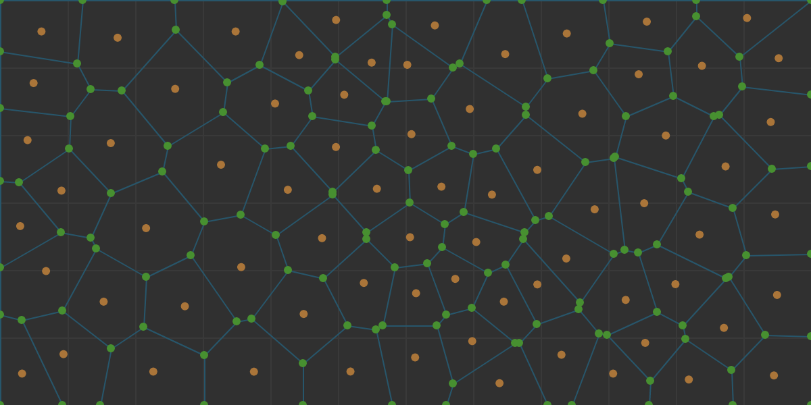
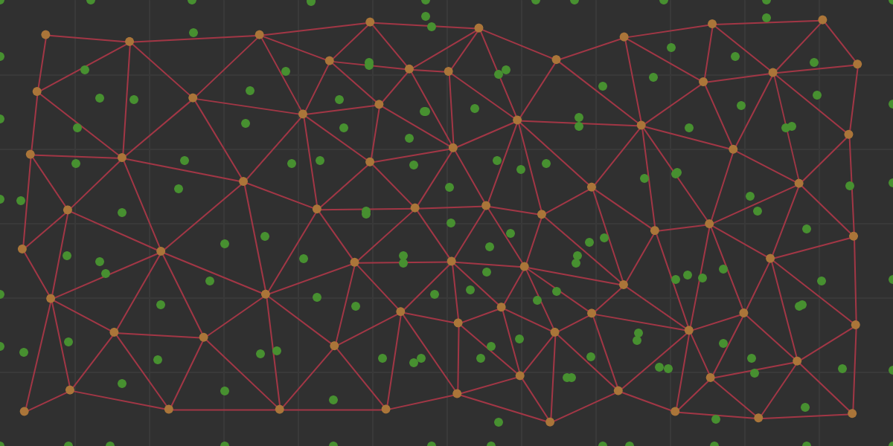

# Atum Procedural Generation Library

Atum is a graph based procedural generation library build for Javascript. The approach to this library is to make as little assumptions as possible about the content that is being generated. The only main assumption is that the generative structure is based off a graph structure.

## Getting Started With Atum Development / Build

### Dependencies and Tools

Atum uses [**Node's npm**](https://nodejs.org/en/download/) for package management and [**Grunt**](https://gruntjs.com/) as a task runner. These are required in order to get started with development. They are quite usefull tools if you don't have them already.

```bash
# Get the code from repository and download the dependencies
npm install https://github.com/Evelios/Atum.git

# Installs grunt for command line use
npm install -g grunt-cli                         
```

### Grunt Tasks

Once the source and dependencies are downloaded. Navigate to the source directory and grunt can run the following commands.

```bash
grunt build     # Build the source code to ./build/Atum.js

grunt dev       # Build the source code and watch for changes to rebuild

grunt docs      # Generate the documentation in ./doc with root at ./doc/index.html
```

## Basic Usage

All the code is written to the new [ES6 Standards](http://es6-features.org). They are cool. Check them out. However there is not support for these yet so everything is transpiled down to ES5 standards. With this there is still support for AMD *require* tags. There is also support for globals by including in a script tag.

### Node.js Style

There is support for the AMD style inclusion so as not to clutter the global space.

```js
var Atum = require('Atum');     // Locally Scoped Atum variable

var vector = new Atum.Geometry.Vector(5, 7);
```

### Script include

This example is all done within the .html document for simplicity. But once you include the Atum.js file. It works like most libraries so you do not have to explicitly get the Atum variable. It is provided to the script as a global variable.

```html
<script src='./path-to-Atum/Atum.js'></script>

<script>
    // Now we can simply access the included globaly scoped Atum variable
    var vector = new Atum.Geometry.Vector(5, 7);
</script>
```

## A Simple Example

Lets create a basic voronoi graph. Let's assume you have done the above and have the Atum variable in scope. We want to create short handles for all the classes we are going to use. Then lets greate a graph object!

```js
// First we declare the dependencies to shorten their names
var PointDistribution = Atum.Utility.PointDistribution;
var Rectangle = Atum.Geometry.Rectangle;
var Vector = Atum.Geometry.Vector;
var Diagram = Atum.Graph.Diagram;

// Now lets create a voronoi diagram
var bbox = new Rectangle(Vector.zero(), width, height);
var points = PointDistribution.random(bbox, 50);
var graph = new Diagram(points, bbox, 2);
```

Here you can see the contents of the graph object that we just created. All it takes is 3 lines to get a voronoi graph!

The Generated Voronoi Diagram



The Generated Delaunay Diagram



## Attributions

Without the support of these other projects I would be writting a lot more code than I would like to be. This project is built off of their hard work.

- Raymond Hill's [Javscript Vornoi Library](https://github.com/gorhill/Javascript-Voronoi)
- Seph Gentle's [Javascript Seeded Random Generator](https://github.com/davidbau/seedrandom)
- David Bau's [Javascript Noise Library](https://github.com/josephg/noisejs)
- Jeffrey Hearn's [Javascript Poisson Disk Sampling](https://github.com/jeffrey-hearn/poisson-disk-sample)

## License

Copyright 2017 Thomas Waters
This project is released under the [MIT License](LICENSE.md) to further the usable body of work for procedural generation or anything else you have in mind.