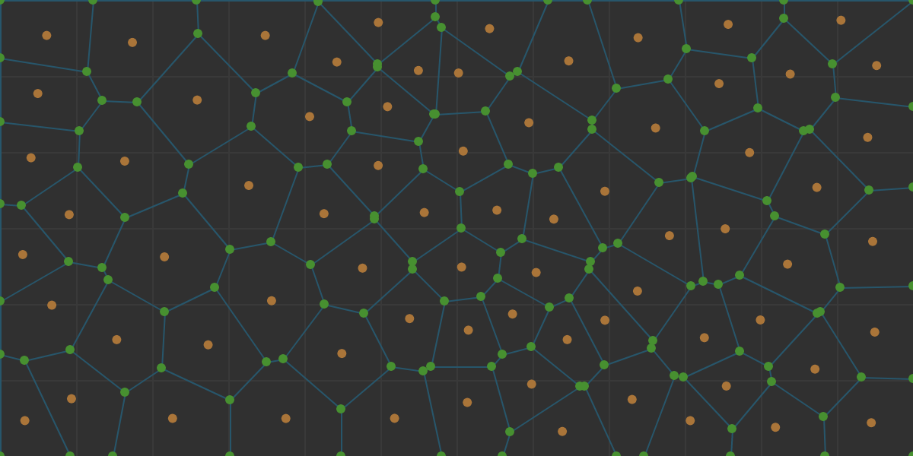
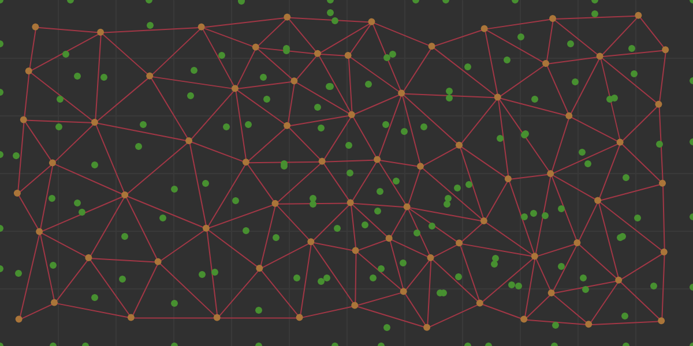

# Atum Procedural Generation Library

Atum is a graph based procedural generation library build for Javascript. I started the library as an extension to a map generator that I was developing. All the core functionality was to better create and document those common processies. This library is tailored in that direction. I do intend to expand into other useful procedural generation techniques but everything takes time. This library is intended to make getting into procedural generation as easy as possible. Due to the generic graph structure implemented this library is not as efficient as a specifically grid or square based approach. 

## Getting Started With Atum Development / Build

### Documentation

[**Here is the documentation for the Atum library**](https://evelios.github.io/Atum/index.html). This is where you find the tutorials and all the nitty-gritty details of what the methods do and where this library can take you. I plan to have examples on how this code can be used to at least spark some ideas and allow the library to get used to its full potential.

### Development Dependencies and Tools

Atum uses [**Node's npm**](https://nodejs.org/en/download/) for package management and [**Grunt**](https://gruntjs.com/) as a task runner. These are required in order to get started with development. They are quite usefull tools if you don't have them already.

```bash
# Install Node and npm and get the most recent version of npm
# Get the latest version of npm and ensure node was installed
npm install npm

# Install Atum through npm
npm install atum

# Get the Atum code from repository and download the dependencies
npm install https://github.com/Evelios/Atum.git

# Installs grunt for command line use
npm install -g grunt-cli           
```

### Grunt Tasks

Once the source and dependencies are downloaded. Navigate to the source directory and grunt can run the following commands.

```bash
# Build the source code to ./build/Atum.js and minify to ./build/Atum.min.js
grunt build

# Build the source code in debug mode and watch for changes, then rebuild
grunt dev      

# Generate the documentation in ./docs with root at ./docs/index.html
grunt docs
```

## Basic Usage

If you are using the library all you need is to have the Atum.js or Atum.min.js file to use in your project. This can be done in one of the several ways mentioned above.

All the code is written to the new [ES6 Standards](http://es6-features.org). They are cool. Check them out. However there is not support for these yet so everything is transpiled down to ES5 standards. With this there is still support for AMD *require* tags. There is also support for globals by including in a script tag.

### Node.js Style

There is support for the AMD style inclusion so as not to clutter the global space.

```js
// Create a Locally Scoped Atum variable
var Atum = require('Atum');     

var vector = new Atum.Geometry.Vector(5, 7);
```

### Script include

This example is all done within the .html document for simplicity. But once you include the Atum.js file. It works like most libraries so you do not have to explicitly get the Atum variable. It is provided to the script as a global variable.

```html
<script src='./path-to-Atum/Atum.js'></script>

<script>
    // Now we can simply access the included globaly scoped Atum variable
    var vector = new Atum.Geometry.Vector(5, 7);
</script>
```

## A Simple Example

Lets create a basic voronoi graph. Let's assume you have done the above and have the Atum variable in scope. We want to create short handles for all the classes we are going to use so that our code is easier to use and we can see the dependencies in the beginning. Then lets create a graph object!

```js
// First we declare the dependencies to shorten their names
var PointDistribution = Atum.Utility.PointDistribution;
var Rectangle = Atum.Geometry.Rectangle;
var Vector = Atum.Geometry.Vector;
var Diagram = Atum.Graph.Diagram;

// Now lets create a voronoi diagram
var boundingBox = new Rectangle(Vector.zero(), width, height);
var points = PointDistribution.random(boundingBox, 50);
var graph = new Diagram(points, boundingBox, 2);

// You can now access different parts of the graph
var centers = graph.centers;
var edges = graph.edges;
var corners = graph.corners;
```

Here you can see the contents of the graph object that we just created. All it takes is 3 lines to get a voronoi graph! And with this we can go on to use the graph. Below are two images of the interconnectedness of the graph we created.

The Generated Voronoi Diagram Showing Connected Corners Points



The Generated Delaunay Diagram Showing Connected Center Points



## Change Log

### Release V 1.0.0
+ Redistribution Functions
    * identity, inverse, exp (exponential), pow (power), step
+ Seeded Random Number Generator
    * Global and Local Seeded Rng's
    * Rand function for 0-1
    * Random range
    * Random integer range
    * Random hex and hex colors
    * Random vector creation
+ Point Distributions
    * Square
    * Hexagon (Partially functional due to library issue)
    * Random
    * Jittered Grid
    * Poisson
+ Voronoi Graph Creation
    * Geometry: Vector, Shape (Abstract), Polygon, Rectangle, Line
    * Graph: Voronoi Diagram Object, Corners, Centers, Edges

## Attributions

Without the support of these other projects I would be writting a lot more code than I would like to be. This project is built off of their hard work.

- Raymond Hill's [Javscript Vornoi Library](https://github.com/gorhill/Javascript-Voronoi)
- Seph Gentle's [Javascript Seeded Random Generator](https://github.com/davidbau/seedrandom)
- David Bau's [Javascript Noise Library](https://github.com/josephg/noisejs)
- Jeffrey Hearn's [Javascript Poisson Disk Sampling](https://github.com/jeffrey-hearn/poisson-disk-sample)

## License

Copyright 2017 Thomas Waters
This project is released under the [MIT License](LICENSE.md) to further the usable body of work for procedural generation or anything else you have in mind.