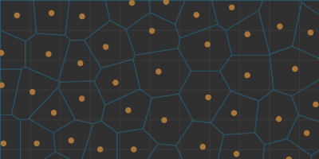

# Learning the Basics of Atum

### Introduction
Atum is a graph based library so most of the functionality revolves around those ideas. That being said I wanted to create the library to be as agnostic or generic in application as much as possible. This generality may be a boon or not but it is the approach that I am taking to try to promote as much procedural content as possible.

### A Note About ES6 vs ES5 Standards

If you are unfamiliar of what ES6 is, the quick explination is that it is new programming standards and syntax that is rolling out for javascript. Although this wave is slow to roll out. That being said, my libary is written so that it can use the full benefits of these new standards. Although to keep up backwards compatability I deliver all my modules to be used in the ES5 format so that no one is missing out on the wonderful benefits of what this libary has to offer. This should have no effect as a user but might be an interesting tidbit to consider.

## 1. Getting Started

To include the package into your library all you have to do is

```bash
# Assuming that you are using node package manager
npm install Atum

# Otherwise just download the source from github
https://github.com/Evelios/Atum
```
When you have the source code you can then use it in your project. This project is build so that you can user it either on the server side with Node.js or you can include the script file into your HTML to use it like most standard libraries by acessing the Atum library as a global variable.

### Using Require Tags With Node.js

This package is built to use the AMD style require tags, which is the standard that is used within the Node environment. To include that package you can simply do

```js
// Create a Locally Scoped Atum variable
var Atum = require('Atum');     

var vector = new Atum.Geometry.Vector(5, 7);
```

Now you have access to the Atum library and you have used it to create a **vector** object.

### Including Atum in an HTML Document

You can include the file into your HTML document directly with the Atum variable being globally available in the script you are trying to write.

```html
<html>
<head>

    <!-- Include the Atum library -->
    <script src='./path-to-Atum/Atum.js'></script>

    <!-- You scripting goes here -->
    <script>
        // Now we can simply access the included globaly scoped Atum variable
        var vector = new Atum.Geometry.Vector(5, 7);
    </script>

</head>
</html>
```

That was everything included in a single file which is simple for explination but in practice you will have the js code in a seperate file. In which case you would do something more along the lines of,

*index.html*
```html
<html>
<head>

    <script src='./path-to-Atum/Atum.js'></script>
    <script src='./script.js'></script>

</head>
</html>
```

*script.js*
```js
// The library's global variable Atum is still available to use here
var vector = new Atum.Geometry.Vector(5, 7);
```

Now that you have been able to include the script tag, from here on out I am going to assume that the Atum global variable is included in your script somehow.

## 2. Library Structure

This library is indended to be used for a variety of topics because procedural generation is a wide ranging topic and can be applied to anything you can possibly dream up. However this library focuses on the graph based approach which can be really beneficial and easily applicable to games. This library tries to take and implement many common pcg approaches although there are lots so this will take time. Here are the main sections that are implemented at this point. They will be explained in further detail later.

**Geometry Objects**
- Vector
- Line
- Polygon
- Rectangle
- Triangle

**Graph Objects**
- Center
- Corner
- Edge
- Diagram

**Other Utilities**
- Point Distributions
- Random Number Generator
- Redistribution Functions

## 3. Creating a Diagram

The diagram class is a graph object that can be used as a starting point. There are many different ways of acquiring or creating a graph object to use as the start of the algorithm. However this one is the most generic and is one that can be used as a blank template made up of many *similar* sized tiles. Here we are only going to go into the basics of how to get started. The other sections will go into more depth on those topics. As a quick note about style, I like to declare my Atum variables at the top of the file because this lets you use shorter names for object creation and function calls and lets you see the files dependencies at a quick glance.

```js
// First we declare the dependencies to shorten their names
var PointDistribution = Atum.Utility.PointDistribution;
var Rectangle = Atum.Geometry.Rectangle;
var Vector = Atum.Geometry.Vector;
var Diagram = Atum.Graph.Diagram;
```
In order to create a graph object we need two things. We need a rectangle which contains our graph. This is the bounding box of our graph area. This bounding box could be the size of a level, the size of a browser window, or something smaller like the size of a tile you want to create a texture on. The second thing we need is the points that you make the graph out of. The graph object is made up of a bunch of connected points. The graph structure is a voronoi graph. Each point is connected to its closest neighbor. This connection style forms a series of tiles filling the entire bounding box.

For this example we are going to create a new bounding box out of a rectangle. Then create a point distribution of a reasonable point density. The point density is how tight the point distribution should be. With a density of 50, each point should be on average 50 away from eachother. Then with our point density we will create our diagram from these objects. Here I am using a poisson distribution because it creates a uniform tile that is not repeated.

```js
var width = 400;
var height = 600;
var pointDensity = 50;

var boundingBox = new Rectangle(Vector.zero(), width, height);
var points = PointDistribution.poisson(boundingBox, pointDensity);
var graph = new Diagram(points, boundingBox);
```
And visualizing what was just created you get the following. The orange are the center points that were created with the point distribution and the blue lines are the edges of the graph.



### Using the Diagram Object

With all this information you can do anything your heart desires. From the graph as a whole you can access individual pieces to do something with them (As I have done to draw the graph in that image). There are three main elements in the graph structure. The center which is created by the point distribution. The edge which is the line that represents the location eqidestant between two points, which can also be thought of as the border between the centers. The last is the corner which is formed by several edges comming together.

```js
// You can now access different parts of the graph
var centers = graph.centers;
var edges = graph.edges;
var corners = graph.corners;
```

Each one of these three objects also has the ability to access is connected features. From the center you can get the connecting center, corner, and edge objects.

```js
// Connections from the center
var center = centers[1]; // Choosing a random center for the example
var centers = center.neighbors;
var edges = center.borders;
var corners = center.corners;
```

The edges may seem a bit confusing at first but looking at the structure that creates it makes it less confusing. There are two graph structures that underly this diagram. There is a voronoi structure and a deluany structure. The deluany connections are all the connections of center points to eachother and the voronoi is the connections of all the corners on the inside of the graph (this one generally excludes corners on the border of the bounding box). So here the edge.d elements are centers and the edge.v elements are corners. A quick note here is that v0 or v1 may be null because the edge may be on the edge of the graph and there is no other center that exists there. It would have to exist on the outside of the bounding box for there to be another one.

```js
// Connections from the edges
var edge = edges[1];
var center0 = edge.d0; // d stands for the deluany connection
var center1 = edge.d1;
var corner0 = edge.v0; // v stands for the voronoi connection
var corner1 = edge.v1;
```
The corners are fairly straight forward similar to the center objects.

```js
// Connections from the corners
var corner = corners[1];
var centers = corner.touches;
var edges = corner.protrudes;
var corners = corner.adjacent;
```

Other tutorials will go show a working example to put these things in context.